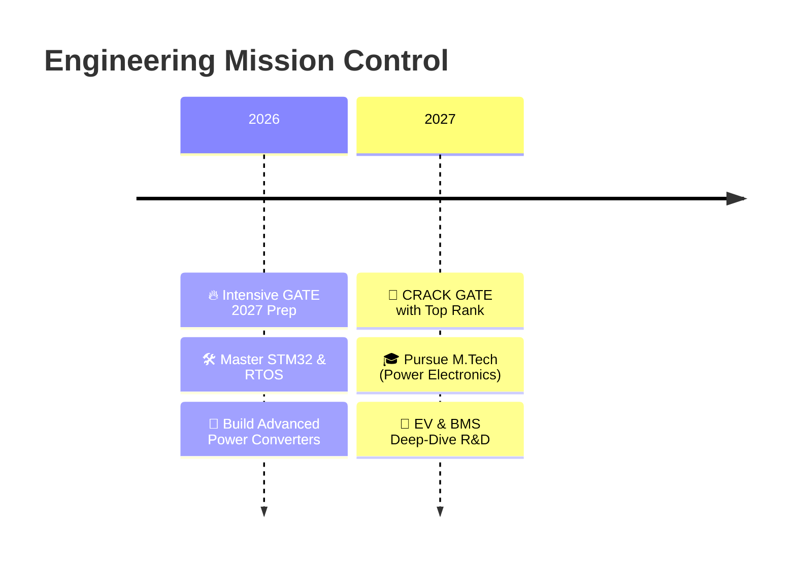

<!-- ============================================ -->
<!--  🚀 SYSTEM BOOT: ENGINEERING DASHBOARD v2.0   -->
<!-- ============================================ -->

<p align="center">
  
</p>

<!-- ============================================ -->
<!--  🖥️  SYSTEM STATUS BAR                        -->
<!-- ============================================ -->
<p align="center">
  <a href="https://github.com/Lawrance016"></a>
  <a href="https://github.com/Lawrance016?tab=followers"></a>
  <a href="#"></a>
  <a href="#"></a>
</p>

---

<!-- ============================================ -->
<!--  🧠  ABOUT / TERMINAL INTERFACE              -->
<!-- ============================================ -->
###  `>_ SYSTEM.INFO`

```yaml
USER: Joshua Lawrance R
ROLE: Electrical & Electronics Engineering Undergraduate
MISSION: Power Electronics | Embedded Systems | Control Theory
STATUS: 🔥 GATE 2027 Prep | 🚀 R&D Prototyping
CORE_PASSION: 
  - ⚡ Power Electronics (Conversion, DC-DC, Motor Drives)
  - 🎛️ Closed-Loop Control Systems
  - 🔌 Hardware & Firmware Co-Design
CURRENT_OBJECTIVE: 
  - Crack GATE 2027 with top rank (Focus: Power Electronics & Control)
  - Build industry-grade embedded hardware prototypes
MOTTO: "From Silicon to System, Ideas into Impact."
```

---

<!-- ============================================ -->
<!--  🎯  GATE 2027 PREPARATION DASHBOARD         -->
<!-- ============================================ -->
## 🎯 `>_ GATE_2027_COMMAND_CENTER`

<p align="center">
  
  
  
</p>

> ⚡ **I live and breathe Power Electronics.** My entire engineering journey revolves around mastering the physics, modeling, and control of power converters. GATE 2027 is my gateway to top-tier research institutions, and I am engineering my preparation with the precision of a closed-loop PID controller!

| 📚 Subject | 🎯 Focus Level | 💡 My Edge |
|:---|:---:|:---|
| **⚡ Power Electronics** | `████████████████████ 95%` | Core passion; practical converter design & PI control |
| **🎛️ Control Systems** | `████████████████░░░░ 80%` | Closed-loop stability, frequency response, Root Locus |
| **🔌 Electrical Machines** | `████████████░░░░░░░░ 65%` | Understanding EV motors & drives |
| **📊 Network Theory** | `█████████████░░░░░░░ 70%` | Circuit solving & transients |
| **🔋 BMS & EV Tech** | `██████████████░░░░░░ 75%` | Future R&D focus aligned with GATE syllabus |

> 🎯 **Goal:** Secure a top rank to pursue advanced research in **Power Electronics & EV Drivetrain Systems**.

---

<!-- ============================================ -->
<!--  🚀  PROFESSIONAL EXPERIENCE (NEW ADDITION)   -->
<!-- ============================================ -->
## 💼 `>_ DEPLOYMENT_EXPERIENCE`

### 🚌 Industrial Visit Coordinator — *Hyderabad Tech Corridor*
> Spearheaded the coordination of a large-scale industrial visit to **Hyderabad**, handling end-to-end logistics, technical liaison with industry leaders, and student safety protocols. This experience sharpened my project management skills and gave me firsthand exposure to large-scale power systems and automated manufacturing lines in action.

### 🎓 Summer Intern — NIT Tiruchirappalli
> **Project:** Closed-Loop Voltage Regulation of a DC-DC Boost Converter using PI Control.
> - Simulated and modeled power stages in **MATLAB/Simulink**.
> - Tuned PI controllers for tight voltage regulation under load variations.
> - Bridged the gap between theoretical control systems and practical embedded implementation.

---

<!-- ============================================ -->
<!--  🛠️  TECH_STACK (Engineer's Toolbox)         -->
<!-- ============================================ -->
## 🛠️ `>_ ENGINEERING_TOOLBOX`

| 🏗️ Domain | 🧰 Technologies & Tools |
|:---|:---|
| **⚡ Power & Control** | `MATLAB` `Simulink` `PI Control` `State-Space` `Bode Plots` |
| **🔌 Embedded Systems** | `ESP32` `STM32` `Arduino` `Embedded C` `RTOS` |
| **📡 Communication** | `UART` `SPI` `I²C` `CAN` |
| **🔧 Hardware Design** | `KiCad` `Altium` `Oscilloscopes` `Function Generators` |
| **🧠 Firmware Logic** | `ADC` `PWM` `Timers` `Interrupts` `Sensors` |
| **🤖 Simulation** | `Proteus` `LTspice` `PSIM` |

<p align="center">
  
  
  
  
  
  
  
</p>

---

<!-- ============================================ -->
<!--  🔥  FEATURED_PROJECTS                       -->
<!-- ============================================ -->
## 🚀 `>_ ACTIVE_PROJECTS`

| ⚡ Project | 🔬 Tech Stack | 🏆 Impact |
|:---|:---|:---|
| **Closed-Loop DC-DC Boost Converter** | `PI Control` `MATLAB` `Simulink` | Internship project @ NIT Trichy |
| **Dynamic Reconfiguration Kit** | `Hardware` `Automation` | 🥇 **1st Prize** - Hardware Hackathon |
| **ESP32 Plant Watering System** | `ESP32` `ADC` `Relay` | Automated precision agriculture prototype |
| **Intelligent Vehicle Safety System** | `Sensors` `Embedded C` | Real-time vehicle monitoring R&D |

---

<!-- ============================================ -->
<!--  🏆  ACHIEVEMENTS & LEADERSHIP               -->
<!-- ============================================ -->
## 🏆 `>_ RANKING_BOARD`

<p align="center">
  
  
  
  
</p>

- 🥇 **1st Prize** – Dynamic Reconfiguration Kit (Hardware Innovation)
- 🥈 **2nd Prize** – Hardware Concept Presentation
- 🎓 **Summer Intern** – Power Electronics @ NIT Trichy
- 🚌 **Industrial Visit Lead** – Successfully coordinated the Hyderabad industrial tour, ensuring seamless technical engagement for 40+ students.

---

<!-- ============================================ -->
<!--  📈  GITHUB STATS (Dashboard View)           -->
<!-- ============================================ -->
## 📊 `>_ GIT_STATS`

<p align="center">
  
  
</p>

<p align="center">
  
</p>

<p align="center">
  
</p>

---

<!-- ============================================ -->
<!--  🎯  MISSION_ROADMAP                         -->
<!-- ============================================ -->
## 🗺️ `>_ ROADMAP_2026-2027`



> **Current Sprint:** Deep-diving into **Power Electronics (Switching Converters, SMPS, Inverters)** and **Control Systems (Root Locus, Bode, Nyquist)** for GATE 2027, while simultaneously building hands-on hardware prototypes to solidify my practical intuition.

---

<!-- ============================================ -->
<!--  🤝  NETWORK_INTERFACE                       -->
<!-- ============================================ -->
## 🌐 `>_ CONNECT`

<p align="center">
  <a href="https://www.linkedin.com/in/lawrance016"></a>
  <a href="mailto:joshualawrance16@gmail.com"></a>
  <a href="https://github.com/Lawrance016"></a>
</p>

---

<!-- ============================================ -->
<!--  🦾  FOOTER                                 -->
<!-- ============================================ -->
<p align="center">
  
</p>

<p align="center">
  ⚡ <strong>Engineering Ideas Into Practical Solutions</strong> ⚡<br>
  <em>Build • Test • Learn • Improve • Repeat</em>
</p>
